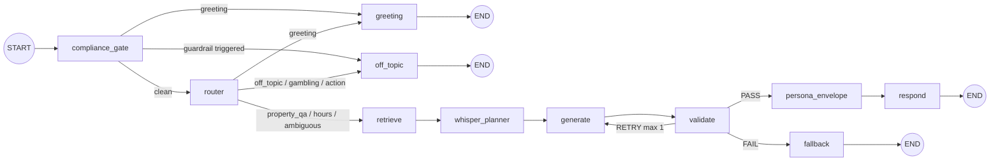

# Architecture

## System Overview

Hey Seven Property Q&A Agent is an AI concierge for Mohegan Sun casino resort. Guests ask natural-language questions about dining, entertainment, hotel rooms, amenities, gaming, and promotions. The agent uses a custom 11-node LangGraph StateGraph with RAG (Retrieval-Augmented Generation) to produce grounded, validated answers streamed token-by-token via Server-Sent Events.

The system has three layers: a vanilla HTML/JS chat frontend, a FastAPI backend with pure ASGI middleware, and a LangGraph agent backed by Gemini 2.5 Flash and ChromaDB. v2 adds a compliance gate (pre-router deterministic guardrails), a Whisper Track Planner (silent background LLM for agent guidance), a persona envelope (SMS truncation layer), 4 specialist agents, SMS/CMS webhooks, and LangFuse observability.

**Design philosophy:** Build for one property, design for N. Every configuration choice (property name, data paths, model name, prompts) is externalized via `pydantic-settings` so adding a second property requires zero code changes.

```
Browser (static/index.html)           Telnyx SMS            Google Sheets CMS
    |                                    |                        |
    | POST /chat (SSE)            POST /sms/webhook        POST /cms/webhook
    v                                    v                        v
FastAPI (src/api/app.py)  <-  SecurityHeaders + HSTS + RateLimit + BodyLimit + Auth + Logging + ErrorHandler
    |
    | lifespan: build_graph() + ingest data
    v
Custom 11-node StateGraph (src/agent/graph.py)
    |
    |-- compliance_gate (73 regex patterns) --> greeting / off_topic / router
    |-- router (structured LLM output) -----> greeting / off_topic / retrieve
    |-- retrieve -----> ChromaDB
    |-- whisper_planner -----> Gemini 2.5 Flash (silent background plan)
    |-- generate (specialist dispatch) -> host/dining/entertainment/comp agent -> Gemini 2.5 Flash
    |-- validate -----> Gemini 2.5 Flash (adversarial review)
    |-- persona_envelope -----> SMS truncation (160-char segments)
    |-- respond / fallback / greeting / off_topic -----> END
    |
    v
Gemini 2.5 Flash               Knowledge Base              LangFuse
(config-driven)                (data/mohegan_sun.json       (observability)
                                -> ChromaDB)
```

---

## Custom StateGraph

The agent is a hand-built `StateGraph` (not `create_react_agent`). Every request flows through an explicit graph of 11 nodes with three conditional routing points.



<details><summary>ASCII fallback</summary>

```
START --> compliance_gate --+--> greeting ----------------------------------------> END
                            |
                            +--> off_topic -------------------------------------> END
                            |
                            +--> router --+--> greeting ------------------------> END
                                          |
                                          +--> off_topic ----------------------> END
                                          |
                                          +--> retrieve --> whisper_planner --> generate --> validate --+--> persona_envelope --> respond --> END
                                                                                   ^                   |
                                                                                   |                   +--> generate  (retry, max 1)
                                                                                   +-------------------+
                                                                                                       +--> fallback --> END
```

</details>

Entry point: `build_graph()` in `src/agent/graph.py` compiles the graph with a checkpointer (defaults to `MemorySaver` via `get_checkpointer()` in `src/agent/memory.py` for local development; `FirestoreSaver` when `VECTOR_DB=firestore`).

---

## Node Descriptions

### 1. compliance_gate (`src/agent/compliance_gate.py`)

**Purpose**: Run all 5 deterministic guardrail layers as a single pre-router node. Zero LLM calls — pure regex classification.

**Input**: `messages` (conversation history).
**Output**: `query_type` (str or None), `router_confidence` (float).

Priority order (first match wins):
1. Turn-limit guard: if `messages` exceeds `MAX_MESSAGE_LIMIT` (default 40), forces `off_topic`.
2. Empty message: routes to `greeting`.
3. Prompt injection (`audit_input()`): 11 patterns — routes to `off_topic`.
4. Responsible gaming (`detect_responsible_gaming()`): 31 patterns (17 EN + 8 ES + 3 PT + 3 ZH) — routes to `gambling_advice`.
5. Age verification (`detect_age_verification()`): 6 patterns — routes to `age_verification`.
6. BSA/AML (`detect_bsa_aml()`): 14 patterns — routes to `off_topic`.
7. Patron privacy (`detect_patron_privacy()`): 11 patterns — routes to `patron_privacy`.
8. All pass: `query_type=None` signals the downstream router to classify via LLM.

All guardrail patterns are defined in `src/agent/guardrails.py` (73 total patterns). The compliance gate centralizes all deterministic checks that previously ran inside `router_node`, ensuring they execute before any LLM call.

### 2. router (`src/agent/nodes.py`)

**Purpose**: Classify user intent into one of 7 categories using structured LLM output.

**Input**: `messages` (conversation history).
**Output**: `query_type` (str), `router_confidence` (float 0-1).

Categories: `property_qa`, `hours_schedule`, `greeting`, `off_topic`, `gambling_advice`, `action_request`, `ambiguous`. Two additional categories (`age_verification`, `patron_privacy`) are detected by the upstream `compliance_gate` before the router runs.

Uses `llm.with_structured_output(RouterOutput)` for reliable JSON parsing via `ainvoke()` (fully async). On LLM error, defaults to `property_qa` with confidence 0.5.

All 11 node functions are `async def`, using `ainvoke()` for LLM calls. This ensures proper async execution throughout the LangGraph pipeline without blocking the event loop. The `retrieve` node wraps sync ChromaDB calls in `asyncio.to_thread()` since ChromaDB's LangChain wrapper only offers synchronous methods — the production path (Vertex AI Vector Search) has native async APIs.

### 3. retrieve (`src/agent/nodes.py`)

**Purpose**: Search the ChromaDB knowledge base for documents relevant to the user query.

**Input**: `messages` (extracts last `HumanMessage`).
**Output**: `retrieved_context` (list of `{content, metadata, score}` dicts).

Routes to `search_hours()` for `hours_schedule` queries, otherwise calls `search_knowledge_base()`. Both use **multi-strategy retrieval with Reciprocal Rank Fusion (RRF)**:

- `search_knowledge_base()`: Combines (1) direct semantic search with (2) entity-augmented search (`{query} name location details`) for improved proper noun matching
- `search_hours()`: Combines (1) schedule-augmented search (`{query} hours schedule open close`) with (2) direct semantic search for broader venue context
- RRF fusion score: `sum(1/(k + rank))` across rankings, with standard `k=60` dampening. Documents appearing in multiple lists receive a boost.

The ChromaDB collection uses **cosine similarity** (`hnsw:space=cosine`) instead of the default L2 distance, producing normalized scores in [0, 1] where 1.0 = exact match.

Results are filtered by `RAG_MIN_RELEVANCE_SCORE` (default 0.3) — chunks below this cosine similarity threshold are discarded before being passed to the generate node.

### 4. whisper_planner (`src/agent/whisper_planner.py`)

**Purpose**: Silent background LLM that guides the speaking agent without generating guest-facing text.

**Input**: `messages` (conversation history, last 20), `extracted_fields` (guest profile).
**Output**: `whisper_plan` (dict from `WhisperPlan.model_dump()` or `None`).

Analyzes conversation context and guest profile completeness, then produces a structured `WhisperPlan` with:
- `next_topic`: which profiling topic to explore naturally (e.g., `dining`, `party_size`, `offer_ready`)
- `extraction_targets`: specific data points to extract (e.g., `kids_ages`, `dietary_restrictions`)
- `offer_readiness`: float 0.0-1.0 indicating how ready the guest is for a personalized offer
- `conversation_note`: brief tactical note for the speaking agent

**Fail-silent contract**: Any LLM failure returns `{"whisper_plan": None}` — the speaking agent proceeds without guidance. Never crashes the pipeline. Per-turn only (reset by `_initial_state()`).

### 5. generate (`src/agent/nodes.py` / `src/agent/agents/host_agent.py`)

**Purpose**: Produce a concierge response grounded in retrieved context. In v2, the `generate` node name is preserved for SSE streaming compatibility, but execution is delegated to `host_agent` (from `src/agent/agents/host_agent.py`) which receives whisper plan guidance from the upstream `whisper_planner` node.

**Input**: `messages`, `retrieved_context`, `current_time`, `retry_count`, `retry_feedback`, `whisper_plan`.
**Output**: `messages` (appends `AIMessage`), optionally `skip_validation`.

Behavior:
- **Circuit breaker**: Checks `CircuitBreaker.is_open` before building prompts (early exit to avoid wasted work). If open (configurable `CB_FAILURE_THRESHOLD`, default 5 failures within `CB_COOLDOWN_SECONDS`, default 60s), returns a static fallback immediately without invoking the LLM. On success, resets the breaker; on failure, increments the counter. Thread-safe via `asyncio.Lock` to protect concurrent coroutine access to mutable state (`_failure_count`, `_last_failure_time`).
- Formats retrieved context as numbered sources and appends to the system prompt.
- If no context was retrieved, returns a static fallback message and sets `skip_validation=True` to bypass the validator.
- On retry (`retry_count > 0`), injects validation feedback as a `SystemMessage` before conversation history.
- **Message windowing**: Only the last `MAX_HISTORY_MESSAGES` (default 20) human and AI messages are sent to the LLM, bounding context size for long conversations while preserving recent context.
- On LLM error, returns a static error message and sets `skip_validation=True`.

### Specialist Agent Base Pattern (`_base.py`)

All 4 specialist agents (host, dining, entertainment, comp) delegate to a shared
`execute_specialist()` function that handles:
- Circuit breaker checks (fail-open with safe fallback)
- System prompt construction via `string.Template.safe_substitute()`
- Retrieved context formatting and injection
- Whisper planner guidance (host agent only)
- Retry feedback injection on validation failures
- Sliding window on conversation history
- Error handling with `skip_validation=True` for safe fallback paths

The `skip_validation` contract: when set to `True`, the downstream `validate_node`
is bypassed entirely. This is used for deterministic fallback paths (circuit breaker
open, no retrieved context, LLM errors) that don't need adversarial validation.

**Whisper planner cost note**: The whisper planner adds one additional LLM call
per property_qa turn. At Gemini 2.5 Flash pricing ($0.15/1M input, $0.60/1M output),
this adds ~$0.0003 per turn. The planner can be disabled via the
`whisper_planner_enabled` feature flag without code changes.

### 6. validate (`src/agent/nodes.py`)

**Purpose**: Adversarial review of the generated response against 6 criteria.

**Input**: `messages` (user question + generated response), `retrieved_context`, `retry_count`, `skip_validation`.
**Output**: `validation_result` (PASS/RETRY/FAIL), optionally `retry_count`, `retry_feedback`.

6 criteria: grounded, on-topic, no gambling advice, read-only, accurate, responsible gaming.

Uses a **separate validator LLM** (`_get_validator_llm()`) with `temperature=0.0` for deterministic binary classification (PASS/RETRY/FAIL). This is distinct from the `_get_llm()` singleton (temperature 0.3) used for creative response generation. Both are `@lru_cache` singletons.

Behavior:
- If `skip_validation` is True (empty context, circuit breaker open, or generate error), auto-PASS (these paths produce deterministic safe responses, not LLM-generated content).
- If validation fails and `retry_count < 1`, returns RETRY with feedback.
- If `retry_count >= 1`, returns FAIL (max 1 retry).
- On validation LLM error: **degraded-pass on first attempt** (retry_count == 0) — if `generate_node` produced a response successfully but the validation LLM is unavailable, the generated response is passed through with a warning log. On retry attempts (retry_count > 0), **fail-closed** (returns FAIL, routes to fallback). This balances availability (generate already succeeded) with safety (retries indicate prior issues).

### 7. persona_envelope (`src/agent/persona.py`)

**Purpose**: Apply persona formatting between validation and response. For web mode (`PERSONA_MAX_CHARS=0`): pass through unchanged. For SMS mode (`PERSONA_MAX_CHARS=160`): truncate the last AI message to fit a single SMS segment with ellipsis.

**Input**: `messages` (last AI message).
**Output**: Empty dict (passthrough) or dict with truncated `messages`.

This node sits between `validate` (PASS) and `respond`, enabling channel-specific formatting without modifying the core generation pipeline.

### 8. respond (`src/agent/nodes.py`)

**Purpose**: Extract source categories from retrieved context and prepare final response.

**Input**: `retrieved_context`.
**Output**: `sources_used` (deduplicated list of category strings), `retry_feedback` cleared to `None`.

### 9. fallback (`src/agent/nodes.py`)

**Purpose**: Safe fallback when validation fails after retry.

**Input**: `retry_feedback`.
**Output**: `messages` (appends static AIMessage with contact info), `sources_used` cleared, `retry_feedback` cleared.

Logs the validation failure reason for observability.

### 10. greeting (`src/agent/nodes.py`)

**Purpose**: Return a template welcome message listing available knowledge categories.

**Input**: None (uses `PROPERTY_NAME` from settings).
**Output**: `messages` (appends welcome AIMessage), `sources_used` cleared.

### 11. off_topic (`src/agent/nodes.py`)

**Purpose**: Handle off-topic queries, gambling advice requests, and action requests.

**Input**: `query_type`.
**Output**: `messages` (appends appropriate redirect AIMessage), `sources_used` cleared.

Five sub-cases based on `query_type`:
- `off_topic`: General redirect to property topics.
- `gambling_advice`: Redirect with responsible gaming helplines (NCPG 1-800-MY-RESET / 1-800-699-7378, CT Council 1-888-789-7777, CT Self-Exclusion ct.gov/selfexclusion via DCP).
- `action_request`: Explain read-only limitations, provide contact info.
- `age_verification`: Provide 21+ age requirement per CT gaming law with property contact info.
- `patron_privacy`: Decline to disclose guest presence/identity/membership with privacy explanation.

---

## State Schema

`PropertyQAState` is a `TypedDict` with 15 fields (`src/agent/state.py:30`). `CasinoHostState` is a backward-compatible alias for v2 code that prefers the domain-specific name.

| Field | Type | Description |
|-------|------|-------------|
| `messages` | `Annotated[list, add_messages]` | Conversation history (LangGraph message reducer) |
| `query_type` | `str \| None` | Router classification (9 categories) |
| `router_confidence` | `float` | Router confidence score (0.0-1.0) |
| `retrieved_context` | `list[RetrievedChunk]` | Retrieved documents: `{content, metadata, score}` |
| `validation_result` | `str \| None` | Validation outcome: PASS, FAIL, or RETRY |
| `retry_count` | `int` | Current retry count (max 1 before fallback) |
| `skip_validation` | `bool` | When `True`, validate node auto-passes (set by generate on empty context or LLM error) |
| `retry_feedback` | `str \| None` | Reason validation failed |
| `current_time` | `str` | UTC timestamp injected at graph entry |
| `sources_used` | `list[str]` | Knowledge-base categories cited in the response |
| `active_agent` | `str \| None` | v2: which specialist agent handles the query (host/dining/entertainment/comp) |
| `extracted_fields` | `dict[str, Any]` | v2: structured fields extracted from the guest message |
| `whisper_plan` | `str \| None` | v2: background planner output for agent guidance |
| `delay_seconds` | `float` | v2: response delay for natural pacing (SMS/chat) |
| `sms_segments` | `list[str]` | v2: segmented SMS responses (160-char compliance) |

Two Pydantic models for structured LLM output:

- **`RouterOutput`** (`state.py:73`): `query_type` (`Literal` constrained to 7 LLM-routable categories: `property_qa`, `hours_schedule`, `greeting`, `off_topic`, `gambling_advice`, `action_request`, `ambiguous`) + `confidence` (float, 0.0-1.0). Two additional categories (`age_verification`, `patron_privacy`) are detected by deterministic guardrails in the `compliance_gate` before the LLM router runs, expanding the effective routing space to 9 categories.
- **`ValidationResult`** (`state.py:87`): `status` (`Literal["PASS", "FAIL", "RETRY"]`) + `reason` (str). RETRY is a first-class schema value, ensuring the LLM can signal minor issues worth correcting versus serious violations (FAIL).
- **`WhisperPlan`** (`whisper_planner.py:43`): `next_topic` (`Literal` constrained to 10 profiling topics) + `extraction_targets` (list[str]) + `offer_readiness` (float 0.0-1.0) + `conversation_note` (str). Used exclusively by the `whisper_planner` node for silent agent guidance.

---

## Routing Logic

### route_from_compliance (`src/agent/graph.py`)

Called after the `compliance_gate` node. Routes based on whether deterministic guardrails triggered:

| Condition | Next Node |
|-----------|-----------|
| `query_type is None` (all guardrails passed) | `router` (LLM classification needed) |
| `query_type == "greeting"` | `greeting` |
| All other guardrail-triggered types | `off_topic` |

### route_from_router (`src/agent/nodes.py`)

Called after the `router` node. Returns the next node name:

| Condition | Next Node |
|-----------|-----------|
| `query_type == "greeting"` | `greeting` |
| `query_type in ("off_topic", "gambling_advice", "action_request", "age_verification", "patron_privacy")` | `off_topic` |
| `router_confidence < 0.3` | `off_topic` (low-confidence catch-all) |
| Everything else (`property_qa`, `hours_schedule`, `ambiguous`) | `retrieve` |

### _route_after_validate_v2 (`src/agent/graph.py`)

Called after the `validate` node. v2 routes PASS to `persona_envelope` instead of directly to `respond`:

| Condition | Next Node |
|-----------|-----------|
| `validation_result == "PASS"` | `persona_envelope` |
| `validation_result == "RETRY"` | `generate` (loops back for re-generation) |
| `validation_result == "FAIL"` | `fallback` |

---

## Prompt System

Four `string.Template` prompts in `src/agent/prompts.py`:

### CONCIERGE_SYSTEM_PROMPT

Variables: `$property_name`, `$current_time`.

The main system prompt defining the concierge persona. Opens with a VIP-oriented Interaction Style section (status-affirming language, energy mirroring, curated suggestions). Contains 11 rules:
1. Only answer about the property
2. Information-only (no bookings/reservations)
3. Always search knowledge base first
4. Warm luxury hospitality tone
5. Be honest about gaps
6. Disclaim hours/prices may vary
7. No gambling advice
8. Transparent about being AI
9. Responsible gaming helplines
10. Time-aware answers using injected `$current_time`
11. Competitor deflection — never discuss other properties

Includes prompt injection defense and responsible gaming helpline information.

### ROUTER_PROMPT

Variables: `$user_message`.

Classifies the user message into one of 7 categories with a confidence score. Requests structured JSON output: `{"query_type": "<category>", "confidence": <float>}`.

### VALIDATION_PROMPT

Variables: `$user_question`, `$retrieved_context`, `$generated_response`.

Adversarial review prompt checking 6 criteria: grounded, on-topic, no gambling advice, read-only, accurate, responsible gaming. Includes PASS and FAIL examples for calibration. Returns `{"status": "<PASS|FAIL|RETRY>", "reason": "<explanation>"}`.

### WHISPER_PLANNER_PROMPT

Variables: `$conversation_history`, `$guest_profile`, `$profile_completeness`.

Used by the `whisper_planner` node to produce structured guidance for the speaking agent. Instructs the planner to identify the next profiling topic, list extraction targets, assess offer readiness, and write a tactical note. Rules prevent re-asking known fields and gate offer readiness behind profile completeness thresholds.

---

## Guardrails

Five layers: four deterministic (pre-LLM, centralized in `compliance_gate` node using functions from `src/agent/guardrails.py`) and one LLM-based (post-generation, in `src/agent/nodes.py`). Total: **73 regex patterns** across all deterministic guardrails.

### Deterministic: audit_input (`src/agent/guardrails.py`)

Pre-LLM regex-based prompt injection detection. Checks **11 patterns** (e.g., "ignore previous instructions", "system:", "DAN mode", "pretend you are", base64/encoding tricks, unicode homoglyphs, multi-line injection framing, jailbreak prompts). Detected injections are logged and routed directly to `off_topic` without invoking any LLM.

### Deterministic: detect_responsible_gaming (`src/agent/guardrails.py`)

Pre-LLM regex-based responsible gaming safety net. Checks **31 patterns** across English (17), Spanish (8), Portuguese (3), and Mandarin (3), including: "gambling problem", "addicted to gambling", "self-exclusion", "can't stop gambling", "limit my gambling", "take a break from gambling", "spending too much at the casino", "family says I gamble", "cooling-off period", "want to ban myself", and Spanish equivalents ("problema de juego", "adiccion al juego", "juego compulsivo", "auto-exclusion", "limite de juego", "perdi todo en el casino"). Portuguese patterns ("problema com jogo", "vicio em jogo", "nao consigo parar de jogar") serve CT's diverse Brazilian/Portuguese community. Mandarin patterns ("赌博成瘾", "戒赌", "赌瘾") serve CT casinos' significant Asian clientele. Detected queries are routed directly to `gambling_advice` (which provides NCPG 1-800-MY-RESET, CT Council 1-888-789-7777, and CT DCP self-exclusion resources) without invoking any LLM.

Responsible gaming helplines are defined as a `RESPONSIBLE_GAMING_HELPLINES` constant in `src/agent/prompts.py` (DRY — used in both the system prompt and the `off_topic_node` response). For multi-property deployment across states, these would be loaded from the property data file.

### Deterministic: detect_age_verification (`src/agent/guardrails.py`)

Pre-LLM regex-based age verification guardrail. Checks **6 patterns** for underage-related queries (e.g., "my kid wants to play", "minimum gambling age", "can underage guests enter", "how old do you have to be to gamble", "minors allowed"). Connecticut law requires casino guests to be 21+ for gaming. Detected queries route to `age_verification` which provides a structured response listing what minors can and cannot do at the property, the 21+ requirement, and the ID requirement.

### Deterministic: detect_bsa_aml (`src/agent/guardrails.py`)

Pre-LLM regex-based BSA/AML detection. Checks **14 patterns** for money laundering, structuring, and CTR/SAR evasion queries — including chip walking and multiple buy-in structuring. Casinos are MSBs under the Bank Secrecy Act and must not provide guidance that could facilitate financial crime.

### Deterministic: detect_patron_privacy (`src/agent/guardrails.py`)

Pre-LLM regex-based patron privacy guardrail. Checks **11 patterns** for queries about other guests' presence, identity, or membership status — including social media surveillance, table/machine surveillance, and stalking/tracking patterns. Casinos must never disclose whether a specific person is at the property (privacy obligation and liability safeguard).

### Structural: property_id metadata filter (`src/rag/pipeline.py`)

Every document ingested into ChromaDB includes a `property_id` metadata field derived from `PROPERTY_NAME` (e.g., `"mohegan_sun"`). The retriever filters by this `property_id` on every query, ensuring that only documents from the configured property are returned. This provides a structural grounding guarantee: even if multiple properties share a ChromaDB collection, cross-property data leakage is prevented at the retriever layer — not merely by prompt instructions.

### LLM-based: validate node

Post-generation adversarial review against 6 criteria (see Prompt System above). Catches hallucination, off-topic drift, gambling advice, unauthorized actions. Max 1 retry, then fallback with contact info.

---

## RAG Pipeline

`src/rag/pipeline.py` handles ingestion and retrieval.

### Ingestion

```
mohegan_sun.json --> Parse by category --> Format --> Chunk (800/120) --> Embed --> ChromaDB
```

1. **Load**: Read `data/mohegan_sun.json` (configurable path).
2. **Parse**: Extract items by category. Flatten nested dicts (hotel towers, gaming sub-areas).
3. **Format**: Category-specific formatters for restaurants, entertainment, hotel rooms; generic formatter for others.
4. **Chunk**: `RecursiveCharacterTextSplitter` (800 chars, 120 overlap [15% of chunk size], separators: `\n\n`, `\n`, `. `, ` `). 800 characters is chosen to balance context density vs retrieval precision: casino property items (restaurant descriptions, room details) average 200-400 characters, so 800 chars preserves complete items while allowing the splitter to group related smaller items. Smaller chunks (e.g., 500) would fragment multi-field items; larger chunks (e.g., 1200) would mix unrelated categories.
5. **Embed**: Google `gemini-embedding-001` (768 dimensions).
6. **Store**: ChromaDB collection `property_knowledge`, persistent to disk.

Ingestion runs at FastAPI startup (lifespan) if the ChromaDB `chroma.sqlite3` file does not exist. First boot takes ~30 seconds. Chunks are stored with **deterministic SHA-256 IDs** (hash of content + source metadata), so re-ingestion is idempotent — restarting the application without clearing ChromaDB will not create duplicate chunks.

### Retrieval

Two plain functions in `src/agent/tools.py` (no `@tool` decorators), both using **multi-strategy retrieval with Reciprocal Rank Fusion (RRF)**:

- **`search_knowledge_base(query)`**: Combines semantic search + entity-augmented query (`{query} name location details`) via RRF. Returns `list[dict]` with keys: `content`, `metadata` (category, item_name, source), `score`.
- **`search_hours(query)`**: Combines schedule-augmented query (`{query} hours schedule open close`) + direct semantic search via RRF.

RRF fusion merges multiple ranked lists using `score = sum(1/(k + rank))` with standard `k=60` dampening. Documents appearing in multiple strategies get boosted, improving recall for entity-heavy queries (e.g., "Todd English's") where different strategies surface different relevant docs. Document deduplication uses a SHA-256 hash of `page_content + source` metadata to prevent collision when identical text appears in different categories.

Both use the global `CasinoKnowledgeRetriever` singleton which wraps ChromaDB `similarity_search_with_relevance_scores()`. The collection is configured with `hnsw:space=cosine`, producing cosine similarity scores in [0, 1] where 1.0 = exact match. The `>= RAG_MIN_RELEVANCE_SCORE` (default 0.3) filter applies **after** RRF fusion using the original cosine similarity scores (not RRF rank scores), ensuring absolute semantic relevance regardless of fusion rank.

### Data Model

Property data is a single JSON file with category sections:

| Category | Content |
|----------|---------|
| restaurants | Name, cuisine, hours, price range, location, dress code |
| entertainment | Venues, shows, capacity, schedule |
| hotel | Room types, towers, amenities, rates |
| amenities | Spa, pool, golf, shopping, fitness |
| gaming | Casino areas, games offered (no odds/strategy) |
| promotions | Loyalty program, tiers, benefits |
| faq | Common questions with answers |

Metadata on every chunk: `category`, `item_name`, `source`, `property_id`, `last_updated`, `chunk_index`.

---

## SSE Streaming

`chat_stream()` in `src/agent/graph.py` uses `graph.astream_events(version="v2")`.

### Event Types

| Event | When | Payload |
|-------|------|---------|
| `metadata` | First event | `{"thread_id": "uuid"}` |
| `graph_node` | Node start/complete lifecycle | `{"node": "router", "status": "start\|complete", "duration_ms": 42, "metadata": {...}}` |
| `token` | During `generate` node | `{"content": "..."}` (incremental text chunk) |
| `replace` | After `greeting`, `off_topic`, `fallback`, `compliance_gate`, `persona_envelope`, or `whisper_planner` node | `{"content": "..."}` (full response) |
| `sources` | After stream completes (if any) | `{"sources": ["restaurants", ...]}` |
| `done` | Always last | `{"done": true}` |
| `error` | On exception | `{"error": "message"}` |

Token streaming uses `on_chat_model_stream` events filtered to the `generate` node only. Non-streaming nodes (`greeting`, `off_topic`, `fallback`, `compliance_gate`, `persona_envelope`, `whisper_planner`) emit `replace` events with the full response via `on_chain_end`.

The `graph_node` event provides observability for the frontend's graph trace panel: each node emits a `start` event when it begins and a `complete` event with `duration_ms` and per-node metadata (e.g., `query_type` from router, `doc_count` from retrieve, `result` from validate).

The `/chat` endpoint wraps `chat_stream()` in an `EventSourceResponse` with a configurable timeout (default 60s via `SSE_TIMEOUT_SECONDS`).

---

## API Endpoints

Defined in `src/api/app.py`.

### POST /chat

Send a message, receive an SSE token stream.

**Request body** (Pydantic-validated in `src/api/models.py`):
- `message` (str, 1-4096 chars, required)
- `thread_id` (UUID string, optional -- auto-generated if omitted)

**Response**: `EventSourceResponse` with typed SSE events.

**Error responses**: 422 (validation), 429 (rate limited), 503 (agent not initialized).

### GET /health

Returns 200 when healthy, 503 when degraded (so Cloud Run / k8s don't route traffic to unhealthy containers).

```json
{
  "status": "healthy | degraded",
  "version": "0.1.0",
  "agent_ready": true,
  "property_loaded": true,
  "observability_enabled": false
}
```

The `observability_enabled` field indicates whether LangFuse tracing is active (determined by `is_observability_enabled()` from `src/observability/langfuse_client.py`).

### GET /graph

Returns the StateGraph structure for frontend visualization.

```json
{
  "nodes": ["compliance_gate", "router", "retrieve", "whisper_planner", "generate", "validate", "persona_envelope", "respond", "fallback", "greeting", "off_topic"],
  "edges": [
    {"from": "__start__", "to": "compliance_gate"},
    {"from": "compliance_gate", "to": "router", "condition": "clean (no guardrail match)"},
    {"from": "retrieve", "to": "whisper_planner"},
    {"from": "validate", "to": "persona_envelope", "condition": "PASS"},
    ...
  ]
}
```

### POST /sms/webhook

Telnyx inbound SMS webhook handler. Processes `message.received` events only. Parses the Telnyx payload and routes to `handle_inbound_sms()` (from `src/sms/webhook.py`). Keyword responses (STOP, HELP, etc.) are handled immediately; regular messages return a receipt for full agent routing (Phase 2.4).

### POST /cms/webhook

Google Sheets CMS content update webhook. Verifies HMAC-SHA256 signature against `CMS_WEBHOOK_SECRET`, then delegates to `handle_cms_webhook()` (from `src/cms/webhook.py`). Returns 403 on signature mismatch.

### POST /feedback

Accepts user feedback on agent responses. Validates UUID `thread_id` and rating (1-5). Comments are PII-redacted via `src/api/pii_redaction.py` before logging. In production, feedback is forwarded to LangFuse as a score.

### GET /property

```json
{
  "name": "Mohegan Sun",
  "location": "Uncasville, CT",
  "categories": ["restaurants", "entertainment", ...],
  "document_count": 42
}
```

### GET /

Static file serving (chat UI from `static/` directory).

---

## Middleware Stack

Six pure ASGI middleware classes in `src/api/middleware.py` (no `BaseHTTPMiddleware`, which breaks SSE streaming):

| Middleware | Purpose |
|------------|---------|
| `RequestLoggingMiddleware` | Structured JSON access logs (Cloud Logging compatible), `X-Request-ID` injection, `X-Response-Time-Ms` header |
| `SecurityHeadersMiddleware` | `X-Content-Type-Options: nosniff`, `X-Frame-Options: DENY`, CSP, `Referrer-Policy`, `Strict-Transport-Security` (HSTS with 2-year max-age) |
| `ApiKeyMiddleware` | `X-API-Key` header validation on `/chat` using `hmac.compare_digest`. Disabled when `API_KEY` is empty. Returns 401 on mismatch |
| `RateLimitMiddleware` | Sliding-window per client IP on `/chat` only (default: 20 req/min). Respects `X-Forwarded-For` behind reverse proxies (Cloud Run, nginx). Memory-bounded via `RATE_LIMIT_MAX_CLIENTS` cap (default 10,000). Returns 429 with `Retry-After`. `/health` and static files exempt |
| `RequestBodyLimitMiddleware` | Two-layer enforcement: fast-path `Content-Length` header check + streaming byte counting via `receive_wrapper`. Rejects requests exceeding `MAX_REQUEST_BODY_SIZE` (default 64 KB) with 413 Payload Too Large. Prevents resource exhaustion even when `Content-Length` is missing or spoofed |
| `ErrorHandlingMiddleware` | Catches unhandled exceptions, returns structured 500 JSON. `CancelledError` (SSE client disconnect) logged at INFO, not ERROR |

---

## Testing Strategy

### Test Pyramid

| Layer | Scope | LLM | Command |
|-------|-------|-----|---------|
| Unit | Individual functions, state, config, guardrails, middleware, agents, SMS, CMS, observability | Mocked | `make test-ci` |
| Integration | Full graph flow (v2 11-node), API endpoints, RAG pipeline, SMS/CMS webhooks | Mocked LLM, real ChromaDB | `make test-ci` |
| Deterministic Eval | Multi-turn conversations, answer quality, guardrails | VCR fixtures (`_FixtureReplayLLM`) — no API key needed | `make test-ci` |
| Live Eval | Answer quality with real LLM, hallucination detection | Real Gemini (temp=0) | `make test-eval` |

### Deterministic Eval via VCR Fixtures

The `_FixtureReplayLLM` class in `tests/test_eval_deterministic.py` replays pre-recorded LLM responses from fixture files, enabling comprehensive evaluation tests in CI without API keys. This VCR-style pattern provides:
- Reproducible test results (no LLM variability)
- Multi-turn conversation testing with checkpointer verification (`aget_state()` confirms 4+ messages persist across turns)
- Zero API cost in CI (no Gemini calls)
- Immediate failure detection on graph logic regressions

### Makefile Targets

| Target | Command |
|--------|---------|
| `make test-ci` | `pytest tests/ -v --tb=short -x --ignore=tests/test_eval.py` |
| `make test-eval` | `pytest tests/test_eval.py -v --tb=short` |
| `make lint` | `ruff check src/ tests/` |
| `make run` | `uvicorn src.api.app:app --host 0.0.0.0 --port 8080 --reload` |
| `make docker-up` | `docker compose up --build` |
| `make smoke-test` | `curl /health` |
| `make ingest` | Run RAG ingestion manually |

---

## Trade-offs

### Why Custom StateGraph vs create_react_agent

| Aspect | Custom StateGraph (chosen) | create_react_agent |
|--------|---------------------------|-------------------|
| Validation loop | Built-in: generate -> validate -> retry/fallback | Not available without wrapping |
| Routing control | Explicit 7-category router with confidence threshold | LLM decides tool calls implicitly |
| Time awareness | `current_time` injected into state at entry | Must be added to system prompt manually |
| Domain guardrails | Dedicated off_topic, gambling_advice, action_request, age_verification, patron_privacy paths | Single system prompt, no structured routing |
| Observability | Each node is individually traceable in LangSmith | Tool calls are traceable but routing is opaque |
| Code complexity | More code (11 nodes, 3 routing functions) | ~10 lines to set up |
| Flexibility | Full control over retry logic, validation criteria | Simpler but less control |

### Degraded-Pass Validation Strategy

The validate node uses a **degraded-pass** strategy when the validator LLM fails:

| Attempt | Validator LLM failure behavior | Rationale |
|---------|-------------------------------|-----------|
| First attempt | **PASS** (serve unvalidated response) | Availability over safety — a failed validator should not block an otherwise grounded response |
| Retry attempt | **FAIL** (route to fallback) | Safety over availability — if validation failed twice, the response is suspect |

**Trade-off**: On first attempt, the system may serve an unvalidated LLM response to a casino guest. This is acceptable because: (1) the response is still RAG-grounded by the generate node's context, (2) deterministic guardrails (prompt injection, responsible gaming, age verification, competitor deflection) run *before* the LLM and are not affected, (3) the fallback path always provides safe, human-written responses with the property's contact information.

In production, this trade-off should be reviewed with the compliance team. A stricter policy (fail-closed on all validator failures) trades availability for safety.

### Single-Worker Assumption

Several in-memory data structures (rate limiter, circuit breaker, retriever singleton) rely on single-worker deployment (`--workers 1` in Dockerfile). This is a documented demo trade-off:

| Component | Risk with `--workers > 1` | Production path |
|-----------|--------------------------|-----------------|
| `RateLimitMiddleware._requests` | Per-worker rate limiting (each worker has its own counter) | Redis-backed distributed rate limiter |
| `CircuitBreaker` singleton | Per-worker circuit state (failures not shared) | Redis or shared-memory state |
| `get_retriever()` singleton | Multiple ChromaDB instances (memory waste, no data conflict) | Vertex AI Vector Search (stateless client) |

### CSP ``unsafe-inline``

The security headers middleware uses ``script-src 'self' 'unsafe-inline'`` and ``style-src 'self' 'unsafe-inline'`` because the demo serves a single-file chat UI (``static/index.html``) with embedded ``<style>`` and ``<script>`` blocks. No user-generated content is rendered as HTML, so the XSS attack surface is minimal.

**Production path**: Externalize CSS/JS into separate static files and replace ``'unsafe-inline'`` with nonce-based CSP — generate a per-request nonce in middleware and inject it into ``<script nonce="...">`` tags.

### Demo vs Production

| Component | Demo | Production |
|-----------|------|------------|
| Vector DB | ChromaDB (in-process, persistent) | Vertex AI Vector Search |
| Checkpointing | MemorySaver (lost on restart) | FirestoreSaver (`VECTOR_DB=firestore`) |
| LLM auth | API key in `.env` | Vertex AI IAM + GCP Secret Manager |
| Deployment | Docker Compose (local) | Cloud Run |
| Rate limiting | In-memory per-IP dict (single-instance only; reset on restart) | Redis-backed distributed limiter (shared state across instances) |
| SMS | Disabled (`SMS_ENABLED=false`) | Telnyx integration with TCPA compliance |
| CMS | Static JSON data file | Google Sheets CMS with webhook updates |
| Monitoring | Structured logging (LangFuse client scaffolded, not yet wired to graph) | LangFuse + LangSmith + Cloud Monitoring |

---

## Configuration

All settings in `src/config.py` using `pydantic-settings`. Every value is overridable via environment variable.

| Variable | Default | Description |
|----------|---------|-------------|
| `GOOGLE_API_KEY` | (required) | Google AI API key (`SecretStr` — redacted in logs/repr) |
| `API_KEY` | (empty) | When set, `/chat` requires `X-API-Key` header (`SecretStr`) |
| `PROPERTY_NAME` | `Mohegan Sun` | Property name used in prompts |
| `PROPERTY_DATA_PATH` | `data/mohegan_sun.json` | Path to property JSON |
| `PROPERTY_WEBSITE` | `mohegansun.com` | Property website (used in fallback messages) |
| `PROPERTY_PHONE` | `1-888-226-7711` | Property phone (used in fallback and error messages) |
| `MODEL_NAME` | `gemini-2.5-flash` | LLM model |
| `MODEL_TEMPERATURE` | `0.3` | LLM temperature |
| `MODEL_TIMEOUT` | `30` | LLM call timeout (seconds) |
| `MODEL_MAX_RETRIES` | `2` | LLM retry count on failure |
| `MODEL_MAX_OUTPUT_TOKENS` | `2048` | Max response tokens |
| `EMBEDDING_MODEL` | `gemini-embedding-001` | Embedding model (768 dim) |
| `CHROMA_PERSIST_DIR` | `data/chroma` | ChromaDB persistence directory |
| `RAG_TOP_K` | `5` | Number of retrieval results |
| `RAG_CHUNK_SIZE` | `800` | Text chunk size (characters) |
| `RAG_CHUNK_OVERLAP` | `120` | Chunk overlap (characters, ~15% of chunk size) |
| `RAG_MIN_RELEVANCE_SCORE` | `0.3` | Minimum relevance score (0-1, higher = more relevant) to include a result |
| `ALLOWED_ORIGINS` | `["http://localhost:8080"]` | CORS allowed origins |
| `RATE_LIMIT_CHAT` | `20` | Max chat requests per minute per IP |
| `RATE_LIMIT_MAX_CLIENTS` | `10000` | Max tracked client IPs (memory bound) |
| `SSE_TIMEOUT_SECONDS` | `60` | Stream timeout (seconds) |
| `MAX_REQUEST_BODY_SIZE` | `65536` | Max request body in bytes (64 KB) |
| `MAX_MESSAGE_LIMIT` | `40` | Max total messages (human + AI) before forcing conversation end |
| `ENABLE_HITL_INTERRUPT` | `false` | When true, pauses before generate node for human-in-the-loop review |
| `CB_FAILURE_THRESHOLD` | `5` | Consecutive LLM failures before circuit opens |
| `CB_COOLDOWN_SECONDS` | `60` | Seconds before circuit transitions to half-open |
| `GRAPH_RECURSION_LIMIT` | `10` | LangGraph recursion limit (bounds validate→retry loop) |
| `VECTOR_DB` | `chroma` | Vector DB backend: `chroma` (local dev) or `firestore` (GCP prod) |
| `FIRESTORE_PROJECT` | (empty) | GCP project ID for Firestore checkpointer |
| `FIRESTORE_COLLECTION` | `knowledge_base` | Firestore collection name |
| `CASINO_ID` | `mohegan_sun` | Multi-tenant casino identifier |
| `CMS_WEBHOOK_SECRET` | (empty) | HMAC-SHA256 secret for Google Sheets webhook verification |
| `GOOGLE_SHEETS_ID` | (empty) | Google Sheets spreadsheet ID for CMS content |
| `SMS_ENABLED` | `false` | Enable SMS channel support |
| `PERSONA_MAX_CHARS` | `0` | SMS persona truncation (0=unlimited, 160=SMS segment) |
| `TELNYX_API_KEY` | (empty) | Telnyx API key for SMS (`SecretStr`) |
| `TELNYX_MESSAGING_PROFILE_ID` | (empty) | Telnyx messaging profile ID |
| `TELNYX_PUBLIC_KEY` | (empty) | Telnyx webhook signature verification key |
| `QUIET_HOURS_START` | `21` | SMS quiet hours start (9 PM local) |
| `QUIET_HOURS_END` | `8` | SMS quiet hours end (8 AM local) |
| `SMS_FROM_NUMBER` | (empty) | SMS sender number (E.164 format) |
| `LANGFUSE_PUBLIC_KEY` | (empty) | LangFuse observability public key |
| `LANGFUSE_SECRET_KEY` | (empty) | LangFuse observability secret key (`SecretStr`) |
| `LANGFUSE_HOST` | `https://cloud.langfuse.com` | LangFuse server URL |
| `LOG_LEVEL` | `INFO` | Python logging level |
| `ENVIRONMENT` | `development` | Environment name |
| `VERSION` | `0.1.0` | Application version |

---

## Deployment

### Docker

Multi-stage build (`Dockerfile`):
1. **Builder stage**: Python 3.12-slim, installs dependencies to `/build/deps`.
2. **Production stage**: Python 3.12-slim, non-root `appuser`, copies deps and application code.

RAG ingestion runs at FastAPI startup (lifespan), not build time, so `GOOGLE_API_KEY` is not baked into the image.

HEALTHCHECK is defined in both `Dockerfile` (for standalone `docker run`) and `docker-compose.yml` (with environment-specific tuning — longer timeout, 60s start period). The docker-compose definition overrides the Dockerfile default when running via `docker compose up`.

### Docker Compose

Single-service setup with:
- `.env` file for secrets (`GOOGLE_API_KEY`).
- Named volume `chroma_data` for ChromaDB persistence across restarts.
- 2GB memory limit, 60s start period for initial embedding.

### Cloud Build

`cloudbuild.yaml` defines a 5-step CI/CD pipeline:
1. Install dev dependencies (`requirements-dev.txt`), lint (`ruff`), type-check (`mypy`), and run tests with coverage (`pytest --cov --cov-fail-under=90`).
2. Build Docker image tagged with commit SHA.
3. **Trivy container vulnerability scan** — scans for CRITICAL and HIGH severity CVEs (`--exit-code=1` fails the build on findings, `--ignore-unfixed` skips unpatched OS-level CVEs).
4. Push to Artifact Registry (`us-central1-docker.pkg.dev`).
5. Deploy to Cloud Run (us-central1, 2Gi memory, 90s timeout, `--allow-unauthenticated` for demo — API key auth is enforced at the app layer via `ApiKeyMiddleware`).

---

## Cost Model

Estimated per-request cost using Gemini 2.5 Flash pricing (as of Feb 2026):

| Operation | Input | Output | Est. Cost |
|-----------|-------|--------|-----------|
| Compliance gate (regex) | — | — | $0.000000 |
| Router (structured output) | ~200 tokens | ~30 tokens | $0.000075 |
| Whisper planner (structured output) | ~800 tokens | ~60 tokens | $0.000156 |
| Generate (RAG-grounded) | ~2,000 tokens (prompt + context) | ~300 tokens | $0.000825 |
| Validate (adversarial review) | ~1,500 tokens | ~30 tokens | $0.000465 |
| Embedding (query) | ~20 tokens | — | $0.000001 |
| **Total per request** | | | **~$0.0015** |

**Pricing basis**: Gemini 2.5 Flash — $0.15/1M input tokens, $0.60/1M output tokens. Validation retry adds one extra generate + validate cycle (~$0.0013).

**Monthly projections** (single property):

| Traffic | Requests/month | Est. Cost |
|---------|---------------|-----------|
| Low (demo) | 1,000 | ~$1.40 |
| Medium | 50,000 | ~$70 |
| High | 500,000 | ~$700 |

Embedding ingestion is a one-time cost (~$0.003 for 30 documents). ChromaDB storage is free (local). Vertex AI Vector Search adds ~$70/month at production scale.

---

## Latency Budget

Expected per-request latency breakdown (non-cached, single property):

| Phase | P50 | P95 | Notes |
|-------|-----|-----|-------|
| Compliance gate (5 guardrail layers) | <1ms | <1ms | Pure regex, no I/O |
| Router LLM (structured output) | ~200ms | ~500ms | Gemini 2.5 Flash, short prompt |
| Retrieval (ChromaDB) | ~10ms | ~30ms | Local vector search, 5 results |
| Whisper planner LLM | ~300ms | ~600ms | Background guidance, structured output |
| Generate LLM (RAG-grounded) | ~800ms | ~1,500ms | ~2K token prompt, streaming first token ~200ms |
| Validate LLM (adversarial review) | ~300ms | ~600ms | Short prompt, structured output |
| Persona envelope | <1ms | <1ms | String truncation (SMS) or passthrough (web) |
| **Total (happy path)** | **~1.6s** | **~3.2s** | Compliance + router + retrieve + whisper + generate + validate + persona |
| **Total (with retry)** | **~2.7s** | **~5.3s** | Adds one generate + validate cycle |
| **Total (SSE first token)** | **~1.3s** | **~2.6s** | Compliance + router + retrieve + whisper + generate first token |

Deterministic paths (greeting, off_topic, gambling_advice) intercepted at `compliance_gate` skip all LLM calls — P50 <1ms.

*Estimates based on Gemini 2.5 Flash benchmarks (Google AI Studio, Feb 2026) and local ChromaDB profiling. Production latency will vary with network conditions and Vertex AI Vector Search cold starts.*

Circuit breaker open state adds 0ms (immediate static fallback, no LLM call).

---

## Scope Decisions

The following features from the initial architecture specification (`assignment/architecture.md`) were consciously deferred. Each is a production-readiness enhancement, not a demo requirement.

| Feature | Status | Rationale |
|---------|--------|-----------|
| API key authentication (`X-API-Key` + `hmac.compare_digest`) | **Implemented** | Pure ASGI `ApiKeyMiddleware`, disabled when `API_KEY` is empty |
| Circuit breaker pattern | **Implemented** | Async-safe `CircuitBreaker` with `asyncio.Lock` — configurable thresholds (`CB_FAILURE_THRESHOLD`/`CB_COOLDOWN_SECONDS`) → half-open probe |
| Per-category data files (8 JSON files) | Single JSON | Simpler ingestion; per-category files are a multi-property scaling concern |
| Pydantic validation of data files | Deferred | Runtime validation at ingestion is sufficient; schema enforcement adds maintenance burden |
| `structlog` structured logging | Standard `logging` | Cloud Logging compatible JSON emitted by middleware; `structlog` is a luxury, not a necessity |
| nginx frontend container | Deferred | FastAPI serves static files directly; nginx adds container orchestration complexity |
| Multi-property system (`get_property_config()`) | Single property | Demo targets one property; the config externalization enables multi-property with zero code changes |

### Module Organization

`src/agent/` separates concerns into focused modules:

| Module | Responsibility | Lines |
|--------|---------------|-------|
| `guardrails.py` | Deterministic pre-LLM safety (prompt injection 11 patterns, responsible gaming 31 patterns EN+ES+PT+ZH, age verification 6 patterns, BSA/AML 14 patterns, patron privacy 11 patterns — 73 total) | ~262 |
| `compliance_gate.py` | Dedicated compliance node — runs all 5 guardrail layers as single pre-router node (zero LLM calls) | ~99 |
| `circuit_breaker.py` | Async-safe `CircuitBreaker` class + lazy `_get_circuit_breaker()` singleton | ~179 |
| `nodes.py` | 8 async graph nodes (router, retrieve, generate, validate, respond, fallback, greeting, off_topic) + routing functions + dual LLM singletons + dynamic greeting categories (`@lru_cache`) | ~686 |
| `graph.py` | 11-node StateGraph compilation + node name constants + 3 routing functions + HITL interrupt support, `chat()`, `chat_stream()`, `_initial_state()` DRY helper, graph trace metadata extraction | ~428 |
| `state.py` | TypedDict state schema (`PropertyQAState` / `CasinoHostState`, `RetrievedChunk`) + Pydantic structured output models (15 fields) | ~94 |
| `prompts.py` | 4 prompt templates (concierge, router, validation, whisper planner) + helpline constant | ~193 |
| `tools.py` | RAG retrieval with RRF reranking (hash-based dedup, multi-strategy fusion, no @tool decorators) | ~186 |
| `agents/` | 4 specialist agents (host, dining, entertainment, comp) + registry | ~681 |
| `persona.py` | SMS/web persona envelope — truncation layer for 160-char SMS segments | ~49 |
| `whisper_planner.py` | Whisper Track Planner — silent background LLM for agent guidance (fail-silent contract) | ~198 |
| `memory.py` | Checkpointer factory — `MemorySaver` (dev) / `FirestoreSaver` (prod via `VECTOR_DB` config) | ~49 |

#### Additional v2 Modules

| Package | Modules | Responsibility | Total Lines |
|---------|---------|---------------|-------------|
| `src/sms/` | `compliance.py`, `telnyx_client.py`, `webhook.py` | SMS channel: TCPA compliance, Telnyx integration, inbound webhook handler | ~1,021 |
| `src/cms/` | `sheets_client.py`, `validation.py`, `webhook.py` | CMS: Google Sheets client, content validation, webhook handler | ~490 |
| `src/casino/` | `config.py`, `feature_flags.py` | Casino configuration, multi-property feature flags (wired into graph: whisper planner, specialist agents) | ~408 |
| `src/data/` | `guest_profile.py`, `models.py` | Guest profile data model, domain data models | ~802 |
| `src/observability/` | `ab_testing.py`, `evaluation.py`, `langfuse_client.py`, `traces.py` | LangFuse callback handler (wired via RunnableConfig callbacks), A/B hash splitting, evaluation framework, tracing | ~857 |
| `src/api/` | `pii_redaction.py` | PII redaction for feedback comments | ~136 |

All deferred features have clear production paths documented in the Trade-offs section above.

---

Built by Oded Ben-Yair | February 2026
