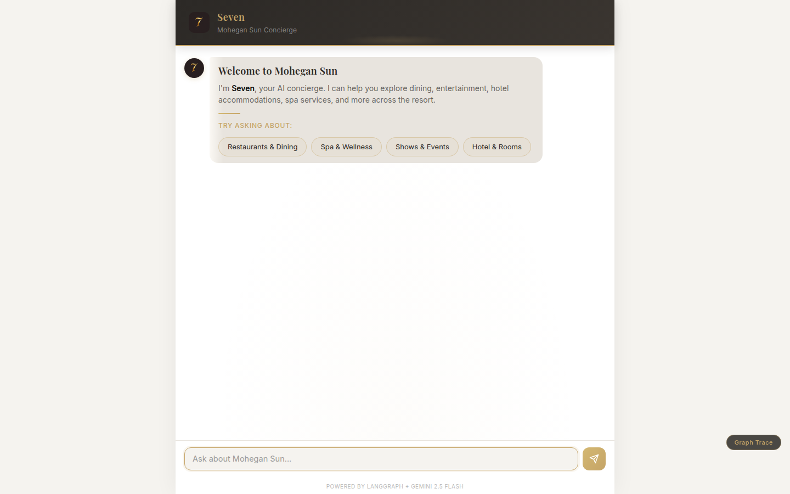

# Hey Seven Property Q&A Agent

An AI concierge for Mohegan Sun casino resort, built with a custom 11-node LangGraph StateGraph.

**[Live Demo](https://hey-seven-180574405300.us-central1.run.app)** · [GitHub](https://github.com/Oded-Ben-Yair/hey-seven)



## Quick Start

```bash
git clone https://github.com/Oded-Ben-Yair/hey-seven.git
cd hey-seven
cp .env.example .env   # Add your GOOGLE_API_KEY
docker compose up --build
# Open http://localhost:8080
```

## Overview

Casino guests need quick, reliable answers about dining, entertainment, rooms, and amenities. This agent retrieves answers from a curated knowledge base using RAG and streams responses token-by-token via Server-Sent Events.

The system uses a **custom 11-node StateGraph** rather than `create_react_agent` because the casino domain requires deterministic guardrails (responsible gaming, prompt injection, BSA/AML compliance) that must fire before the LLM — not as afterthoughts. The v2 graph adds a dedicated **compliance gate** (84 regex patterns across 4 languages) as the first node after START, a **whisper planner** that silently guides the speaking agent with structured plans, and a **persona envelope** for SMS/web formatting. The graph-native validation loop (generate → validate → retry/fallback) provides control that a generic ReAct loop cannot.

The generate node delegates to **specialist agents** (host, dining, entertainment, comp, hotel) via a registry, and the **whisper planner** injects background guidance so each specialist has situational context without the guest seeing internal planning.

The frontend includes a **real-time graph trace panel** that visualizes LangGraph node execution with timing — every query shows which nodes fired, how long each took, and what metadata they produced.

## Architecture

```
START ──> compliance_gate ──┬──> greeting ──────────────────────────────────────────────> END
                            ├──> off_topic ─────────────────────────────────────────────> END
                            └──> router ──┬──> greeting ────────────────────────────────> END
                                          ├──> off_topic ───────────────────────────────> END
                                          └──> retrieve ──> whisper_planner ──> generate ──> validate ─┬──> persona_envelope ──> respond ──> END
                                                                                   ^                   ├──> generate (retry, max 1)
                                                                                   └───────────────────┘
                                                                                                       └──> fallback ──> END
```

**11 nodes, 3 conditional routing points:**

1. **Compliance Gate** — Deterministic pre-router guardrails (84 regex patterns, 4 languages). Blocks prompt injection, responsible gaming, age verification, BSA/AML, and patron privacy queries before any LLM call. Routes clean messages to the router.
2. **Router** — Classifies user intent (7 categories) using `.with_structured_output(RouterOutput)`. Defense-in-depth: second classification layer after compliance gate.
3. **Retrieve** — Searches ChromaDB with multi-strategy RRF reranking (semantic + augmented queries).
4. **Whisper Planner** — Silent background LLM that produces a structured `WhisperPlan` (next topic, extraction targets, offer readiness, conversation note) to guide the speaking agent. Fail-silent: returns `None` on any error so the agent proceeds without guidance.
5. **Generate** — Delegates to a specialist agent (host, dining, entertainment, comp) via the agent registry. Produces a grounded response using the concierge system prompt plus whisper plan context.
6. **Validate** — Adversarial LLM review against 6 criteria (grounded, on-topic, no gambling advice, read-only, accurate, responsible gaming).
7. **Persona Envelope** — SMS/web formatting layer. For web (`PERSONA_MAX_CHARS=0`): pass-through. For SMS (`PERSONA_MAX_CHARS=160`): truncates to 160-char segment limit.
8. **Respond** — Extracts sources, packages final response.
9. **Greeting** — Returns "Seven" persona welcome with property categories.
10. **Off-Topic** — Deterministic guardrail responses (no LLM call).
11. **Fallback** — Safe contact-info response when validation exhausts retries.

## LangGraph Patterns Used

| Pattern | Where | Why |
|---------|-------|-----|
| Custom 11-node StateGraph | `graph.py` | Full control vs `create_react_agent` — validation loops, deterministic guardrails, specialist dispatch |
| Structured output routing | `router_node` | `.with_structured_output(RouterOutput)` — no string parsing |
| Conditional edges with functions | `route_from_compliance`, `route_from_router`, `_route_after_validate_v2` | Explicit, testable routing logic at 3 branch points |
| Graph-native retry loop | validate → generate | Not Python retry — graph-level state loop with counter |
| State schema with reducers | `Annotated[list, add_messages]` | Proper LangGraph state management (see `PropertyQAState` in `src/agent/state.py`) |
| `astream_events` v2 | `chat_stream()` | Most advanced streaming API with per-node event filtering |
| Dual LLM strategy | Generator (0.3) vs Validator (0.0) | Different temperatures for creativity vs strictness |
| HITL interrupt support | `interrupt_before` config | Production pattern for regulated environments |
| Real-time graph visualization | SSE `graph_node` events | Live node execution visible in UI with timing |
| Specialist agent registry | `agents/registry.py` | 5 specialist agents (host, dining, entertainment, comp, hotel) dispatched by query domain |
| Whisper planner (silent LLM) | `whisper_planner.py` | Background planning with `WhisperPlan` structured output — fail-silent, per-turn, never guest-facing |
| Persona envelope | `persona.py` | Channel-aware formatting (web pass-through vs SMS 160-char truncation) |
| Compliance gate (deterministic) | `compliance_gate.py` | Pre-router node with 84 regex patterns — zero LLM cost, zero latency |
| Per-turn state reset | `_initial_state()` | Non-message fields reset every turn; only `messages` persists via checkpointer |

## Real-Time Graph Trace

Every chat request emits `graph_node` SSE events alongside content tokens. The frontend graph trace panel shows:

- Which nodes are **active** (gold pulse), **complete** (solid gold + timing), or **skipped**
- Per-node metadata: router classification + confidence, doc count, whisper plan status, validation result, sources
- Total pipeline timing from compliance gate to respond

This is visible via the "Graph Trace" button in the bottom-right corner.

## Key Design Decisions

| Decision | Choice | Why |
|----------|--------|-----|
| Agent framework | LangGraph custom `StateGraph` (11 nodes) | Validation loop, structured routing, domain guardrails, specialist dispatch |
| LLM | Gemini 2.5 Flash | GCP-aligned, cost-effective (~$0.0014/request) |
| Vector DB | ChromaDB (embedded) | Zero infrastructure for demo; Vertex AI Vector Search or Firestore for production |
| Streaming | Real token SSE via `astream_events` v2 | True progressive rendering with timeout + disconnect detection |
| Embeddings | Google `gemini-embedding-001` | GCP-native, free tier, 768 dimensions |
| Frontend | Single-file HTML/CSS/JS | No build step, minimal footprint, ships with FastAPI |
| Validation | Adversarial LLM review (6 criteria) | Catches hallucination, off-topic drift, gambling advice leaks |
| Config | `pydantic-settings` BaseSettings | 56 env-overridable settings, zero hardcoded values |
| Retrieval | Multi-strategy RRF reranking | Reciprocal Rank Fusion of semantic + augmented queries, hash-based dedup |
| Ingestion | Idempotent with deterministic IDs | SHA-256 content+source hash prevents duplicates on re-ingestion |
| Guardrails | Deterministic regex + LLM validation | Pre-LLM compliance gate blocks injection; 5 categories, 84 patterns, 4 languages |
| Specialist agents | Registry-based dispatch (5 agents) | Domain-specific prompts and tool selection per query type |
| Guest profiles | Per-field confidence with decay | 90-day decay, weighted completeness, CCPA cascade delete |
| SMS compliance | TCPA keyword handling + quiet hours | Deterministic STOP/HELP/START, 280+ area-code timezone mappings, HMAC-authenticated consent hash chain |
| Multi-tenant | Per-casino config with Firestore | Feature flags wired into graph (whisper planner, specialist agents), branding, regulations, 5-min TTL cache, deep-merge defaults |
| CMS | Google Sheets + webhook | Staff-editable content, HMAC-verified webhooks, schema validation |
| Observability | LangFuse (primary) + LangSmith (optional LangChain tracing) | LangFuse callback handler, A/B hash splitting, evaluation framework. LangSmith pass-through via `LANGCHAIN_TRACING_V2` |

## Safety & Guardrails

5 deterministic pre-LLM guardrail categories with 84 regex patterns across 4 languages (English, Spanish, Portuguese, Mandarin):

| Guardrail | Patterns | Trigger |
|-----------|----------|---------|
| Prompt Injection | 11 | Jailbreak attempts, system prompt extraction, encoding tricks, zero-width chars |
| Responsible Gaming | 31 | Problem gambling concerns, self-exclusion requests (EN/ES/PT/ZH) |
| Age Verification | 6 | Underage access, minimum age questions |
| BSA/AML Compliance | 25 | Money laundering, structuring, CTR/SAR evasion, chip walking (EN/ES/PT/ZH) |
| Patron Privacy | 11 | PII requests about other guests, player tracking, surveillance queries |

All guardrails fire in the **compliance gate node** before any LLM call and return deterministic responses with appropriate helpline numbers.

Additionally, 7 PII redaction patterns protect logs and traces: phone, email, credit card, Amex, SSN, SSN-raw, and player card numbers.

## Testing

```bash
make test-ci       # ~1460 tests collected, no API key needed (run for exact count)
make test-eval     # 14 live eval tests (requires GOOGLE_API_KEY)
make lint          # ruff + mypy
```

**~1460 tests collected** across 42 test files and 5 layers:

| Layer | Tests | Description |
|-------|-------|-------------|
| Unit | ~400 | Nodes, guardrails, compliance gate, config, middleware, models, PII redaction, persona, whisper planner |
| Integration | ~200 | Graph execution, API endpoints, SSE streaming, phase 2/3/4 integration |
| Domain | ~200 | Specialist agents, guest profiles, casino config, feature flags, SMS compliance, CMS webhooks, observability |
| Deterministic Eval | ~100 | Pre-recorded LLM fixtures, assertion-based, evaluation framework scoring |
| Live Eval | 14 | Real Gemini API calls, quality scoring (skipped in CI) |

## API Endpoints

| Method | Path | Auth | Description |
|--------|------|------|-------------|
| `POST` | `/chat` | API key (when configured) + rate limit | Send message, receive SSE token stream |
| `GET` | `/health` | None | Health check (200 healthy, 503 degraded) |
| `GET` | `/property` | API key (when configured) | Property metadata (name, categories, doc count) |
| `GET` | `/graph` | API key (when configured) | Graph structure (nodes and edges for visualization) |
| `POST` | `/sms/webhook` | Ed25519 signature (`TELNYX_PUBLIC_KEY`) | Telnyx inbound SMS webhook (TCPA keyword handling) |
| `POST` | `/cms/webhook` | HMAC signature (`CMS_WEBHOOK_SECRET`) | Google Sheets CMS content update webhook |
| `POST` | `/feedback` | API key (when configured) + rate limit | User feedback on agent responses (PII-redacted logging) |
| `GET` | `/` | None | Chat UI |

### SSE Event Types

```
event: metadata     — {"thread_id": "..."}
event: graph_node   — {"node": "compliance_gate", "status": "start"}
event: graph_node   — {"node": "router", "status": "complete", "duration_ms": 450, "metadata": {"query_type": "property_qa", "confidence": 0.95}}
event: token        — {"content": "Mohegan Sun has "}
event: sources      — {"sources": ["restaurants"]}
event: replace      — {"content": "..."} (greeting/off_topic/compliance_gate — replaces streaming)
event: ping         — "" (heartbeat every 15s during generation — clients should ignore)
event: error        — {"error": "..."}
event: done         — {"done": true}
```

### Error Responses

All error responses use a canonical JSON shape:

```json
{"error": {"code": "<error_code>", "message": "Human-readable description"}}
```

| Code | HTTP Status | Retryable | Description |
|------|-------------|-----------|-------------|
| `unauthorized` | 401 | No | Invalid or missing API key / webhook signature |
| `rate_limit_exceeded` | 429 | Yes (after `Retry-After`) | Too many requests per IP |
| `payload_too_large` | 413 | No | Request body exceeds 64 KB |
| `agent_unavailable` | 503 | Yes (after `Retry-After: 30`) | Agent not initialized at startup |
| `internal_error` | 500 | Yes | Unhandled server error |
| `validation_error` | 422 | No | Request body validation failed |
| `service_degraded` | 503 | Yes | Health check reports degraded state |

## Security & Middleware

6 pure ASGI middleware classes (no `BaseHTTPMiddleware` — preserves SSE streaming):

| Middleware | Description |
|-----------|-------------|
| RequestLoggingMiddleware | Cloud Logging JSON format, `X-Request-ID`, `X-Response-Time-Ms` |
| SecurityHeadersMiddleware | `nosniff`, `DENY`, CSP, `Referrer-Policy`, HSTS |
| ApiKeyMiddleware | `X-API-Key` with `hmac.compare_digest` on `/chat`, `/graph`, `/property`, `/feedback` (disabled when `API_KEY` is empty) |
| RequestBodyLimitMiddleware | 64 KB max request body (Content-Length + streaming enforcement) |
| RateLimitMiddleware | Sliding-window per IP, 20 req/min on `/chat` and `/feedback` (shared bucket) |
| ErrorHandlingMiddleware | `CancelledError` at INFO, structured 500 JSON with security headers |

## Configuration

All 56 settings configurable via environment variables (`pydantic-settings`). See [.env.example](.env.example) for full settings documentation.

Settings span 11 categories: Google API, property, LLM tuning, embeddings, RAG pipeline, API server, agent behavior, vector DB, multi-tenant, SMS/CMS, and observability.

## Cost Model

| Traffic | Requests/month | Est. Cost (Gemini 2.5 Flash) |
|---------|---------------|------------------------------|
| Demo | 1,000 | ~$1.40 |
| Medium | 50,000 | ~$70 |
| High | 500,000 | ~$700 |

Per-request: ~$0.0014 (router + generate + validate + embedding). Whisper planner adds ~$0.0003/request. Compliance gate and persona envelope are zero-cost (no LLM calls).

## Planned Improvements

| Component | Current | Production Target |
|-----------|---------|-------------------|
| Vector DB | ChromaDB (in-process) | Vertex AI Vector Search or Firestore vector search (RRF multi-strategy implemented for both) |
| Checkpointing | MemorySaver (lost on restart) | FirestoreSaver (wired, config-driven toggle) |
| Rate limiting | In-memory per-IP | Redis-backed distributed limiter |
| Circuit breaker | In-memory (reset on restart) | Redis-backed with persistence |
| Monitoring | Structured logging (LangFuse scaffolded) | LangFuse + Cloud Monitoring + alerting |
| Frontend | Single HTML file | Next.js with React 19 |
| Guest profiles | In-memory fallback for dev | Firestore with CCPA cascade delete (wired) |
| Multi-tenant config | Firestore with 5-min TTL cache | Firestore with pub/sub invalidation |
| SMS delivery | Telnyx raw HTTP (httpx) | Telnyx SDK with delivery receipts and retry queue |
| CMS | Google Sheets + webhook | Dedicated headless CMS with versioning |
| A/B testing | SHA-256 hash-based splitting (scaffolded) | Feature flag service (LaunchDarkly / Statsig) |
| Load testing | Not yet implemented | Locust or Artillery for throughput and latency validation |
| Deployment | Single revision | Blue-green/canary via Cloud Run traffic splitting |
| Adversarial testing | 84 regex patterns + LLM validation | OWASP prompt injection benchmarks, multilingual red-team testing |

## Project Structure

```
hey-seven/
├── src/
│   ├── config.py                 # 56 env-overridable settings (pydantic-settings)
│   ├── agent/
│   │   ├── graph.py              # 11-node StateGraph + chat + chat_stream (SSE)
│   │   ├── nodes.py              # Node functions + routing logic + circuit breaker
│   │   ├── state.py              # PropertyQAState (13 fields) + 3 Pydantic output models
│   │   ├── prompts.py            # Prompt templates (concierge, whisper planner, VIP tone)
│   │   ├── guardrails.py         # 5 deterministic guardrails (84 patterns, 4 languages)
│   │   ├── compliance_gate.py    # Dedicated compliance node (pre-router, zero LLM cost)
│   │   ├── whisper_planner.py    # Silent background planner (WhisperPlan structured output)
│   │   ├── persona.py            # SMS/web persona envelope (160-char truncation)
│   │   ├── memory.py             # Checkpointer factory (MemorySaver dev / FirestoreSaver prod)
│   │   ├── circuit_breaker.py    # Async circuit breaker (closed → open → half-open)
│   │   ├── tools.py              # search_knowledge_base + search_hours
│   │   └── agents/               # Specialist agents
│   │       ├── registry.py       # Agent registry (get_agent, list_agents)
│   │       ├── host_agent.py     # General concierge agent
│   │       ├── dining_agent.py   # Restaurant & dining specialist
│   │       ├── entertainment_agent.py  # Shows & events specialist
│   │       ├── comp_agent.py     # Comp & rewards specialist
│   │       └── hotel_agent.py    # Hotel & accommodations specialist
│   ├── rag/
│   │   ├── pipeline.py           # Ingest, chunk (800/120), embed, retrieve (ChromaDB)
│   │   ├── embeddings.py         # Google gemini-embedding-001
│   │   └── firestore_retriever.py  # Firestore vector search alternative
│   ├── api/
│   │   ├── app.py                # FastAPI app, lifespan, SSE streaming, webhooks
│   │   ├── models.py             # Pydantic schemas + SSE event models
│   │   ├── middleware.py         # 6 pure ASGI middleware
│   │   └── pii_redaction.py      # 7 PII regex patterns (phone, email, card, SSN, player ID)
│   ├── data/
│   │   ├── models.py             # Guest profile data models (per-field confidence, decay, CCPA)
│   │   └── guest_profile.py      # Guest CRUD (Firestore + in-memory fallback)
│   ├── sms/
│   │   ├── telnyx_client.py      # Telnyx SMS via httpx (GSM-7/UCS-2, segmentation)
│   │   ├── compliance.py         # TCPA compliance (STOP/HELP/START, quiet hours, consent chain)
│   │   └── webhook.py            # Inbound SMS webhook handler
│   ├── casino/
│   │   ├── config.py             # Per-casino config (Firestore, 5-min TTL, deep-merge defaults)
│   │   └── feature_flags.py      # Per-casino feature flag queries
│   ├── cms/
│   │   ├── sheets_client.py      # Google Sheets CMS reader
│   │   ├── webhook.py            # CMS webhook handler (HMAC verification)
│   │   └── validation.py         # Content schema validation
│   └── observability/
│       ├── traces.py             # Trace context (NodeSpan, TraceContext)
│       ├── langfuse_client.py    # LangFuse callback handler (trace → span → generation)
│       ├── evaluation.py         # Evaluation framework (4 scoring dimensions, CI-gate runner)
│       └── ab_testing.py         # A/B testing (SHA-256 hash splitting, variant config)
├── data/mohegan_sun.json         # 79 items, 7 categories
├── static/
│   ├── index.html                # Branded chat UI (gold/dark/cream)
│   └── assets/                   # Custom logo assets
├── tests/                        # ~1460 tests across 42 files
├── Dockerfile                    # Multi-stage Python 3.12, non-root, HEALTHCHECK
├── docker-compose.yml            # Health check, named volume, 2GB limit
├── cloudbuild.yaml               # GCP Cloud Build CI/CD (8-step pipeline with canary + rollback)
└── .env.example                  # Core env vars documented
```

---
